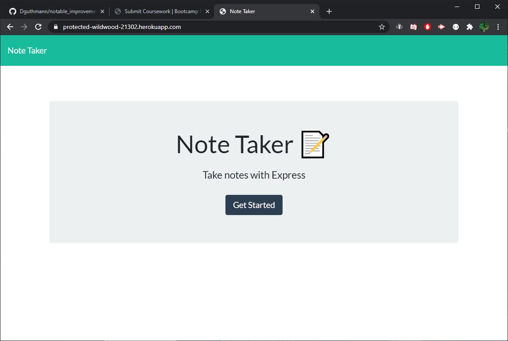

# notable_improvements
### Author: David Guthmann

github: https://github.com/Dguthmann/notable_improvements  
livesite: https://protected-wildwood-21302.herokuapp.com/  

## List of Contents

server.js  
package.json  
package-lock.json  
screenshot.png  
README.md  
LICENSE
### db
db.json
### public
index.html
notes.html
#### css
styles.css
#### js
index.js  

## Installation
you will need the following additional npms to run this project:  
express

## Basic Overview of Project

The goal of the project is to take existing html, js, and css, and write a js file (server) to handle the ajax requests of the other files.  This was an exercise that reminded me how much easier it is to write both ends of the code to match up.  The main frustrations were with dealing with the existing code, all the code "should" link up nicely, as testing with small scale and also postman works perfectly parsing the json, writing to the files, just the provided interface seems to be missing items.

## Screenshot of Project

## Resources Used

Joe Rehfuss for the hot restaraunt activity walk throughs, made perfect sense how everything again *should* line up.

## Further Development Plans

I would love to figure out what is wrong with the base code that's not syncing up

## Changelog

2020-10-09: Writing server.js, and ReadMe  
2020-10-08: Writing some test code, and concept confirmations  
2020-10-07: Research on base concepts  